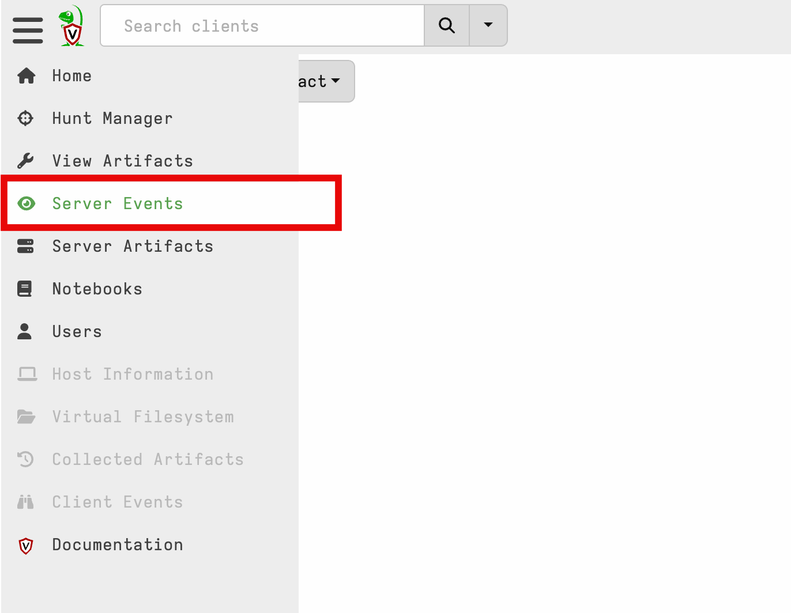
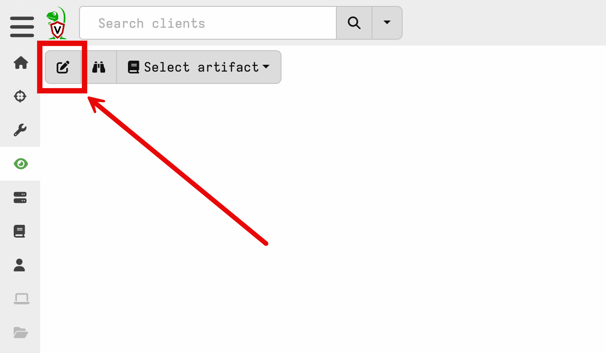
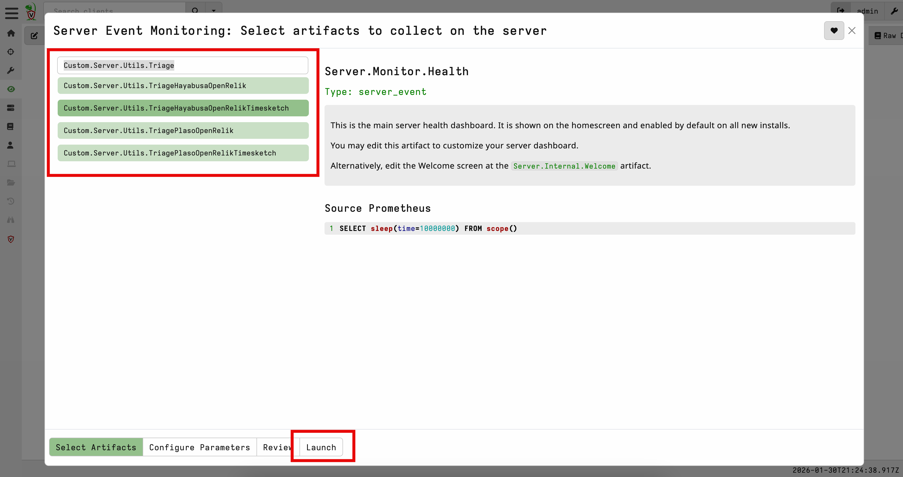
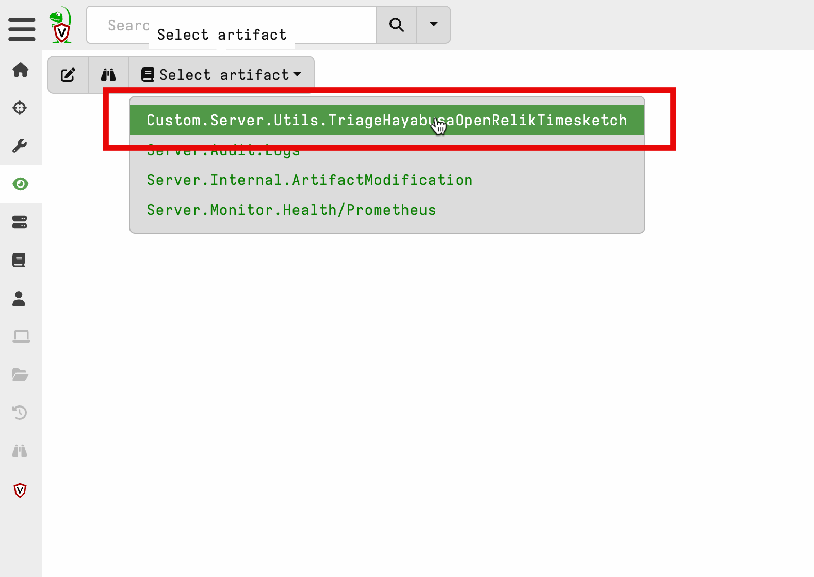

# openrelik-pipeline

### Intro
This repository provides an all-in-one DFIR solution by deploying Timesketch, OpenRelik, Velociraptor, and the custom OpenRelik Pipeline tool via Docker Compose. It allows users to send forensic artifacts (e.g., Windows event logs or full triage acquisitions generated with Velociraptor) to an API endpoint, which triggers a workflow to upload the files to OpenRelik and generate a timeline. Depending on the configuration, the workflow can use log2timeline (Plaso) or Hayabusa to produce the timeline and push it directly into Timesketch. This automated approach streamlines artifact ingestion and analysis, turning what used to be multiple separate processes into a more convenient, “push-button” deployment. 

------------------------------

### Step 1 - Install Docker 
Follow the official installation instructions to [install Docker Engine](https://docs.docker.com/engine/install/).

### Step 2 - Clone the project and set environment variables
```bash
sudo -i
git clone https://github.com/Digital-Defense-Institute/openrelik-pipeline.git /opt/openrelik-pipeline
```
Change `IP_ADDRESS` to your public or IPv4 address if deploying on a cloud server, a VM (the IP of the VM), or WSL (the IP of WSL).
```
export TIMESKETCH_PASSWORD="YOUR_DESIRED_TIMESKETCH_PASSWORD"
export VELOCIRAPTOR_PASSWORD="YOUR_DESIRED_VELOCIRAPTOR_PASSWORD"
export OPENRELIK_ADMIN_PASSWORD="YOUR_DESIRED_OPENRELIK_PASSWORD"
export IP_ADDRESS="0.0.0.0" 
```

### Step 3 - Run the install script to deploy Timesketch, OpenRelik, Velociraptor, and the OpenRelik Pipeline
Depending on your connection, this can take 5-10 minutes.
```bash
chmod +x /opt/openrelik-pipeline/install.sh
/opt/openrelik-pipeline/install.sh 
```

> [!NOTE]  
> Your OpenRelik, Velociraptor, Timesketch usernames are `admin`, and the passwords are what you set above.

### Step 4 - Verify deployment
Verify that all containers are up and running.
```bash
docker ps -a
```

Access the web UIs:
* OpenRelik - http://0.0.0.0:8711
* Velociraptor - https://0.0.0.0:8889
* Timesketch - http://0.0.0.0 

Access the pipeline:
* OpenRelik Pipeline - http://0.0.0.0:5000

Again, if deploying elsewhere, or on a VM, or with WSL, use the IP you used for `$IP_ADDRESS`.

### Step 5 - Access 

#### With curl
You can now send files to it for processing and timelining.

We've provided an example with curl so it can be easily translated into anything else.

Generate a timeline with Hayabusa from your Windows event logs and push it into Timesketch:
```bash
curl -X POST -F "file=@/path/to/your/Security.evtx" http://$IP_ADDRESS:5000/api/hayabusa/timesketch
```

Generate a timeline with Plaso and push it into Timesketch:
```bash
curl -X POST -F "file=@/path/to/your/triage.zip" http://$IP_ADDRESS:5000/api/plaso/timesketch
```

#### With Velociraptor
The repo ships [several Velociraptor artifacts](./velociraptor) that POST collections to the pipeline. These are pre-imported into Velociraptor by `install.sh` — no manual import needed. Look for them in `View Artifacts` under `Server.Utils.Triage*OpenRelik*`.

These are configured to hit each available endpoint:
* `/api/plaso`
* `/api/plaso/timesketch`
* `/api/hayabusa`
* `/api/hayabusa/timesketch`

You can configure them to run automatically by going to `Server Events` in the Velociraptor GUI and adding them to the server event monitoring table. 

By default, they are configured to run when the `Windows.Triage.Targets` artifact completes on an endpoint. 

It will zip up the collection, and send it through the pipeline into OpenRelik for processing.

**Steps:**  
1. Navigate to `Server Events` 
  
2. Click `Update server monitoring table`
  
3. Choose one or more triage artifacts to run in the background and click Launch
  
4. The newly installed monitoring artifacts will soon show up in the `Select artifact` dropdown with logs
  

> [!NOTE]
> When launching `Windows.Triage.Targets` (or any large collection), expand the `Resources` panel and bump `Max upload bytes` above the default 1 GB — a typical workstation's `EventLogs` alone can exceed 1 GB and the flow will be cancelled mid-upload otherwise. 10 GB (`10737418240`) is a reasonable starting point.

------------------------------
> [!IMPORTANT]  
> **I strongly recommend deploying OpenRelik and Timesketch with HTTPS**--additional instructions for Timesketch, OpenRelik, and Velociraptor are provided [here](https://github.com/google/timesketch/blob/master/docs/guides/admin/install.md#4-enable-tls-optional), [here](https://github.com/openrelik/openrelik.org/blob/main/content/guides/nginx.md), ahd [here](https://docs.velociraptor.app/docs/deployment/security/#deployment-signed-by-lets-encrypt). For this proof of concept, we're using HTTP. Modify your configs to reflect HTTPS if you deploy for production use. 

